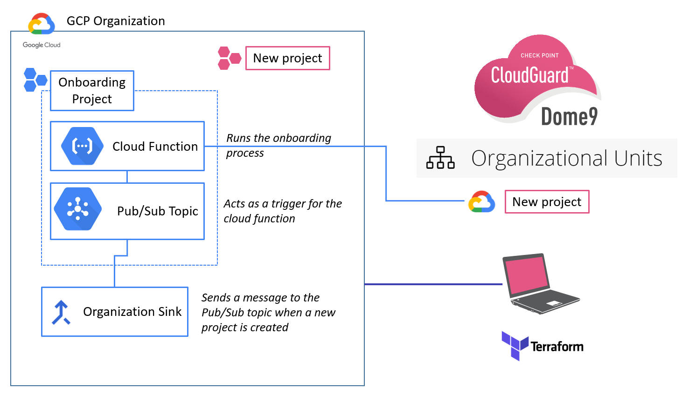
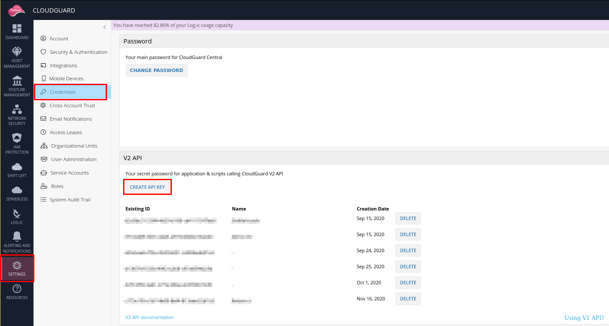

# CloudGuard GCP Onboarder
> Disclaimer: Documentation and reworks in progress

Automatic onboarder for new GCP projects into CloudGuard. A Terraform project,
that deploys a cloud function in Google Cloud that automatically onboards new
GCP projects in [CloudGuard](https://secure.dome9.com/v2/).

### Architecture Diagram

The following image, describes the different components that compose this project


The Terraform files will deploy the following components:
- Organization sink (*please note this sink is created at organization level*)
- Pub/Sub topic. It connects the sink with the cloud function
- Cloud function. Performs the onboarding process:
-- Updates and enables billing information in the new GCP project
-- Enables required APIs that are used by CloudGuard to collect information
-- Creates a service account in the new GCP project that will be used by
CloudGuard to read the project information
-- Create a service account key (needed for the onboarding with CloudGuard)
-- Onboard the account using CloudGuard API

### Deployment instructions

#### Pre requisites

You will need Terraform client to deploy the infrastructure. Please, follow
the [instructions](https://learn.hashicorp.com/tutorials/terraform/install-cli)
provided by Terraform on how to install the CLI for your system.

This project is intended to onboard new projects that are created within a GCP
organization. Therefore, the existence of a GCP organization is a requirement.

The GCP project where you will deploy using Terraform, needs to have the [Cloud
Build API](https://cloud.google.com/cloud-build/docs/api/reference/rest)
enabled.

#### Create credentials for GCP Cloud function

In order for the Cloud Function to have enough permissions at the organization
level, the code will assume that there is a
[credentials.json](cloud-function/credentials/credentials.json) file.

Since the cloud function requires permissions to enable certain APIs and apply
changes at organization level, the proper permissions need to be provided.

#### Input variables
You will need to create a file named terraform.tfvars, within the
[terraform](terraform) directory. You can use the
[terraform.example.tfvars](terraform.example.tfvars) as an example

Required variables and their detailed description:
> Mandatory
- *gcp_project*: The project ID where the resources of the Terraform project
  will be deployed. You can get it navigating to IAM & Admin-> Manage Resources
- *gcp_region* and *gcp_zone*: Region and zone to configure google Terraform
  provider
- *CHKP_CLOUDGUARD_ID* and *CHKP_CLOUDGUARD_SECRET*: CloudGuard token id and
  secret. You can generate this token by logging in
  [CloudGuard](https://secure.dome9.com/v2/). Then in the Settings ->
  Credentials section, click in "Create API Key".

- *billing_account_id*: In order to onboard a GCP projet in CloudGuard, certain
  APIs need to be enabled. Activation of APIs requires enabling billing in the
  project. For that reason, the cloud function will need the billingAccount to
  associate the project with. Open the Navigation Menu using your GCP
  Organization account, and select _"Billing"_. You will see a list of the
  billing accounts. Expected format for this variable is:
  ```"billingAccounts/XXXXXX-XXXXXX-XXXXXX"```
- *organization_id*: Your GCP organization ID. You can find it within the IAM &
  Admin section in the GCP console

>Optional
- *cloudguard_unit_target*: You can specify the name of a CloudGuard
  Organizational Unit to onboard the new account into. To check the OUs,
  navigate to CloudGuard UI: Settings->Organizational Units. If not provided or
  empty string, the root OU will be used for the onboarding.
- *svc_account_name*: Name for the service account that will be used to connect the GCP project with CloudGuard
- *svc_account_display_name*: Display name for the service account
- *bucket_name*: Name of the bucket that will be created to store the Cloud
  Function source code
- *function_source_path*: Path to the ZIP file with the cloud function code
- *function_name*: Cloud function name
- *topic_name*: The name for the Pub/Sub topic
- *sink_name*: The name of the organization logging sink
- *log_level*: Log level for the cloud function. Allowed values are: _DEBUG_,
  _INFO_, _WARN_, _ERROR_, _CRITICAL_

#### Run deployment

1. Replace the [credentials.json](cloud-function/credentials/credential.json) with the proper credential.json file for your organization
2. Create the zip file that holds the cloud function code
```bash
# Zip the cloud-function folder into a zip file
cd cloud-function
zip -r cloud-function.zip
mv cloud-function.zip ..
cd ..
```
3. Customize terraform.tfvars. You can use the provided
[template](terraform/terraform.example.tfvars) as an example
4. Run Terraform CLI
```bash
# Customize you the
cd terraform
terraform init
terraform plan
terraform apply
```

### Troubleshooting

### Known issues

This section describes known issues that you may encounter when deploying the
Terraform template.

#### Cloud Billing quota exceeded
You may encounter issues during the Cloud Function execution when it tries to
update the Cloud Billing information for the project that has been newly
created. You may encounter an error message similar to the following:

```python
response = self.cloudbilling.projects().updateBillingInfo(name=self.project, body=billing_info).execute()
raise HttpError(resp, content, uri=self.uri)
googleapiclient.errors.HttpError: <HttpError 400 when requesting https://cloudbilling.googleapis.com/v1/projects/<project-id>/billingInfo?alt=json returned "Precondition check failed.".
Details: "[{'@type': 'type.googleapis.com/google.rpc.QuotaFailure', 'violations': [{'subject': 'billingAccounts/XXXXXX-XXXXXX-XXXXXX', 'description': 'Cloud billing quota exceeded: https://support.google.com/code/contact/billing_quota_increase'}]}]",
```

You need to access the provided [url](https://support.google.com/code/contact/billing_quota_increase) to
increase the Billing Quota. In order to onboard the project in CloudGuard,
certain GCP APIs need to be enabled, and that requires to enable billing in the
project.

### Deploy using gcloud

If you cannot use Terraform, or you only want to deploy parts of the Terraform template, the following section will describe how to deploy the different pieces of the automatic onboarder
#### Deploy cloud function using gcloud

```bash
gcloud functions deploy <func-name> \
    --trigger-topic=<topic-name> \
    --region=<region-name> \
    --entry-point=pubsub_process \
    --runtime=python38 \
    --env-vars-file cloud-function/env.vars.yaml \
    --timeout 540 --source cloud-function
```

#### Deploy sink using gcloud

```bash
export SINK_NAME=mysink
export PROJECT_ID="my-project-123456"
export TOPIC_NAME="createdProjectsTopic"
export ORGANIZATION_ID="11111111"
gcloud logging sinks create ${SINK_NAME} \
    pubsub.googleapis.com/projects/${PROJECT_ID}/topics/${TOPIC_NAME} \
    --include-children \
    --organization=${ORGANIZATION_ID} \
    --log-filter="resource.type=\"project\" AND protoPayload.methodName=\"CreateProject\""
```
